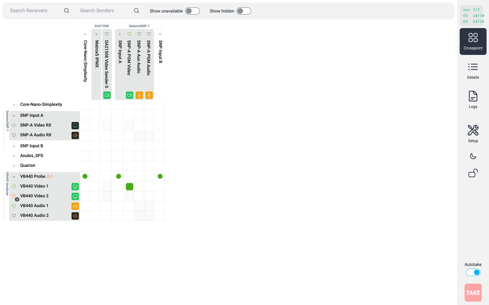
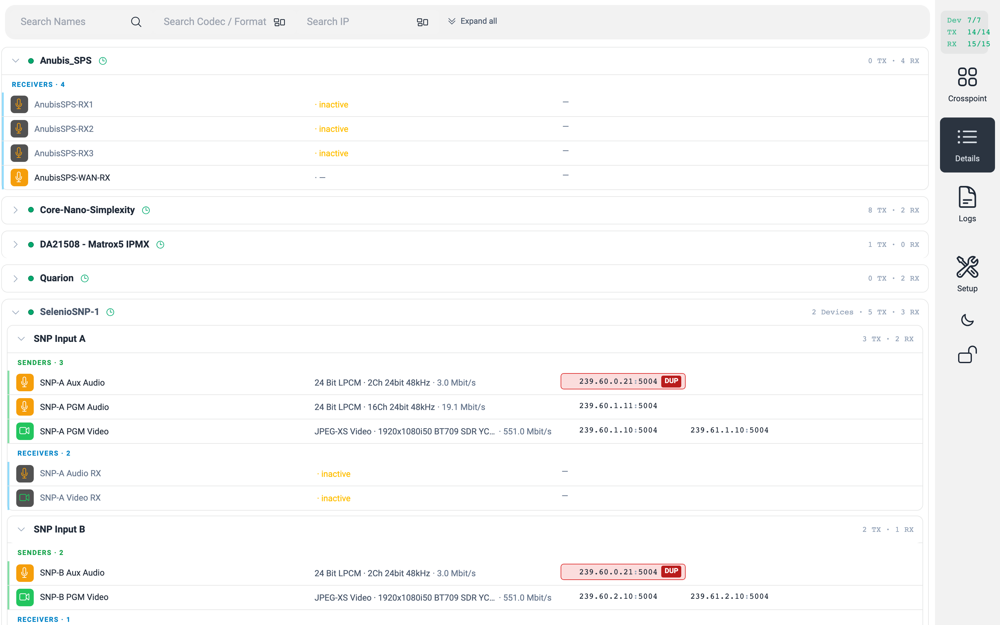
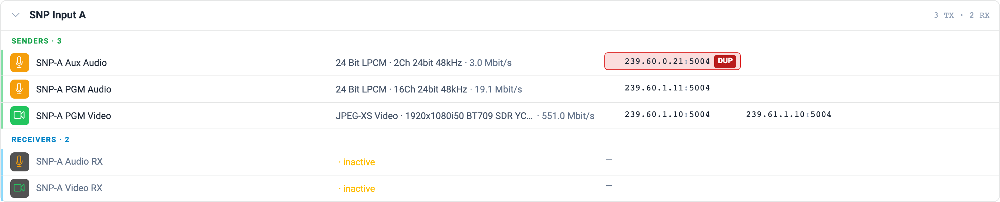
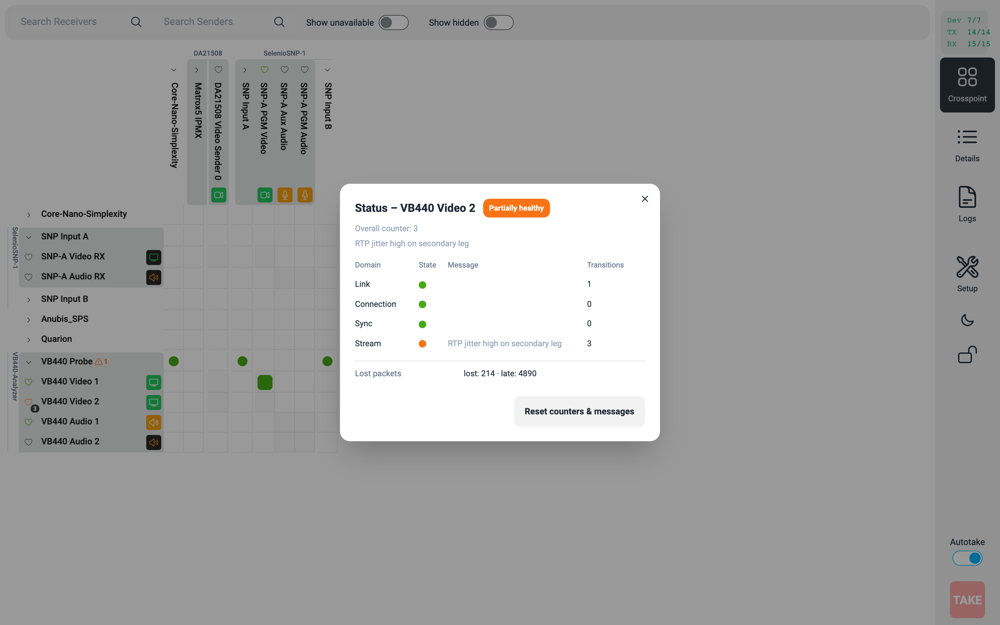
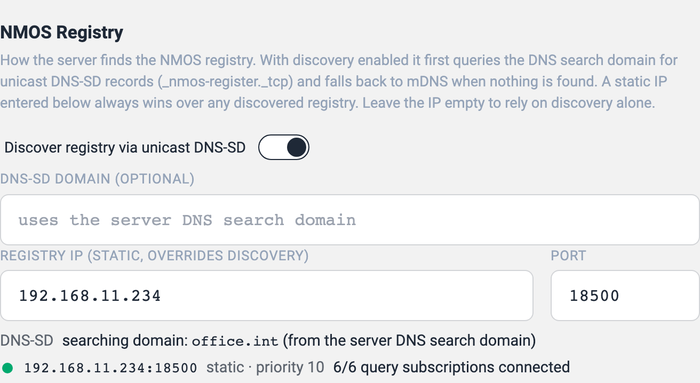
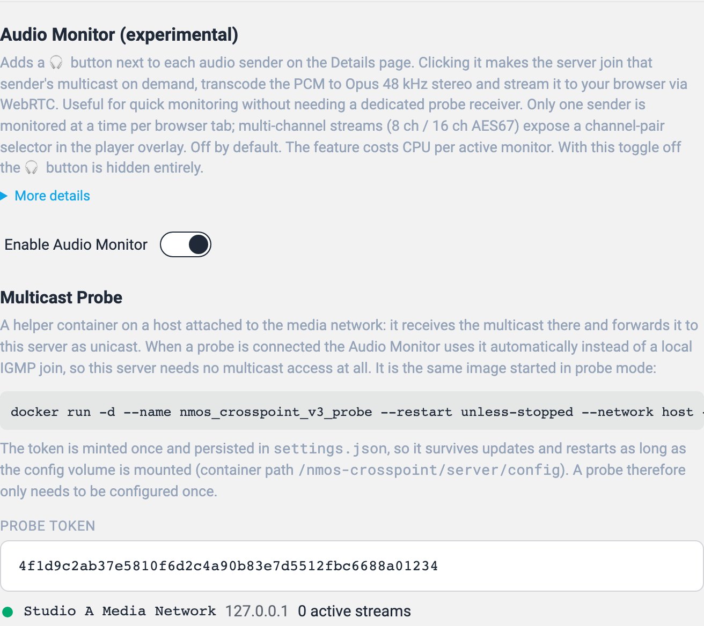
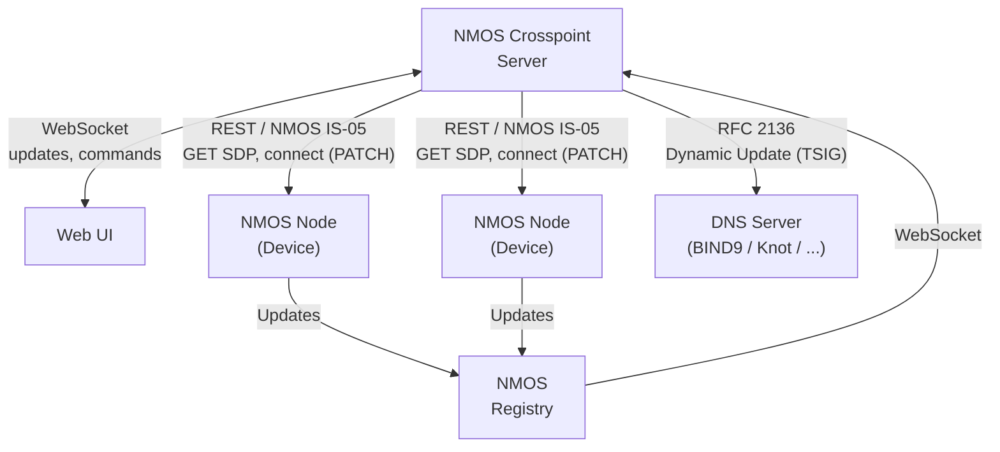

# NMOS Crosspoint

NMOS Crosspoint is a web-based  **NMOS** Controller for **ST 2110 / AES67** media networks. It shows every device on your network, lets you route senders to receivers like a classic crosspoint, takes care of multicast addresses for you, and keeps things tidy with little touches like vendor-specific Web-UI links, DNS hostname registration and PTP health hints.



Tested with a wide range of devices — Lawo, Riedel, Embrionix, AJA, Imagine, Sony, Grass Valley, Blackmagic, Merging, DirectOut, QSC, Matrox — and stable with more than 2000 flows. Let me know if you have any problems




## What it does 
- **Autodiscover.** Finds Senders and Receivers according to NMOS IS-04
- **Registry discovery.** Finds the NMOS registry on its own: unicast DNS-SD against the DNS search domain first, mDNS as fallback, and a static IP always wins when one is configured. The Setup page shows the detected domain, the discovered registry with its source and priority, and the live state of the query subscriptions.
- **Crosspoint matrix.** Click a sender and a receiver to connect them according to NMOS IS-05. Autotake or "stage and then TAKE" workflow.
- **Activate / Deactivate Senders.** Toggle a Sender to be master enabled=true/false. (option) 
- **Multicast DHCP.** Hands out and tracks multicast addresses automatically from a pool you define. (option) 
- **Manual multicast editing.** Each sender's leg can be overridden with a custom address on the Details page; clearing the field falls back to the DHCP-reserved one. 
- **Duplicate-multicast detection.** Runs across every active sender on the network. The offending leg is flagged in the UI so you can spot the conflict immediately.


- **Live device overview.** Every node, device, sender and receiver from the NMOS registry, in real time updated via Websocket Connection from the Registry. 
- **Hide devices.** Hide flows you don't want to see in the matrix without losing the device.
- **Offline devices.** Crosspoint keeps track of offline devices or individual offline senders / receivers; 

- **Web-UI links.** One click opens the device's own configuration page in a new tab.
- **DDNS hostname push.** Each device's name lands as an A record on your DNS server via standard RFC 2136 Dynamic Updates (TSIG-signed) — works with BIND9, Knot, PowerDNS, Windows DNS —, so `Camera1.media.example.net` resolves automatically. (option)
- **Aliases.** Rename a device or a single flow to whatever your operators call it; the original NMOS label is still visible as a tooltip. NMOS IS-13 is planned to push  the Aliases back to the Device.
- **Virtual Senders.** Want do use your old Devices without NMOS Support? Use them as Virtual-Sender in the Crosspoint Matrix by adding their SDP's in the Setup. 
- **PTP health.** Tell Crosspoint which Grand-Master ID is the "correct" one and every device shows a green / yellow / red dot at a glance. 
- **BCP-008 status monitoring.** For devices with an IS-12 control endpoint, Crosspoint subscribes to their NcSender-/NcReceiverMonitors and shows the live health as a heart per flow in the matrix: green / orange / red, with the four status domains (Link, Connection/Transmission, Sync, Stream/Essence), packet counters, transition counters and a counter reset in a click-open status panel that follows live updates. Active crosspoints colour themselves when an endpoint degrades. New senders and receivers appearing on a device are picked up automatically. Read-only on the network. (option, on by default)


- **Audio monitor.** A headphone button next to each audio sender on the Details page: the server joins the multicast on demand, transcodes to Opus and streams it to your browser via WebRTC, with a channel-pair selector for multichannel AES67. (option, off by default; the server needs access to the media network — or use the multicast probe below)
- **Multicast probe.** The same Docker image started with `MODE=probe` on a host that IS attached to the media network: it receives the multicast there and forwards it to the crosspoint as unicast over a token-authenticated websocket. When a probe is connected the audio monitor uses it automatically, so the crosspoint container itself needs no multicast access at all. The Setup page shows the token, the ready-made `docker run` command and the connected probes.
- **Bandwidth estimates.** Crosspoint computes a Mbit/s estimate per flow from the SDP.
- **SDP viewer.** One-click on the `SDP` button next to a sender opens the raw SDP manifest in a modal.
- **Search and filter.** Three independent search boxes on the Details page: by name (device or flow alias), by codec / format (e.g. `L24`, `JPEG-XS`, `1080i50`), and by IP (`239.77.0.85` finds the one sender or receiver that uses that address). Tokens are matched against every matching field — type `Anubis 48` to narrow down to Anubis flows running at 48 kHz. Filters compose so you can quickly locate exactly the one flow you're looking for.

## The Setup page

The Setup page is where everything is configured. Each section in short:

**NMOS Registry, Acceptable PTP GMID, Receiver Auto-Reconnect**
The top of the Setup page. The registry is found automatically (unicast DNS-SD → mDNS → static IP, where a static IP always wins); the live status below the form shows the detected DNS-SD domain and the connected registry with source, priority and subscription health. Changes apply live, no restart needed. Plus: which Grand-Master ID counts as "right" (devices locked to it get a green dot on the Details page, others a yellow one), and whether receivers should re-execute when a sender's SDP changes (off by default — many devices renegotiate on their own).



**Crosspoint: Auto-Activate Sender + Multicast DHCP**
Auto-Activate Sender, off by default, automatically switches on an inactive sender when you patch a receiver to it. Multicast DHCP is the main switch for the address pool — when enabled, every active sender gets a reserved pair of addresses (odd / odd+1 so ST 2022-7 works) drawn from a single CIDR range you define (default `239.30.0.0/16`). The allocator checks both its own pool and every live `destination_ip` on the network before handing out a new pair, so duplicates can't slip through. Manual overrides on the Details page are honoured; clearing the field reverts the leg to its reserved address. When you flip Multicast DHCP on for the first time you're asked whether to **Keep current IPs** (no streams touched) or **Renew from Pool** (everything gets a fresh address).


**Lease Inventory**
Every multicast allocation is listed with live status (active / inactive / missing), category badge (audio / video), bitrate and allocation date. One-click release per row, or "Release all leases" to start fresh. The list can also be exported and imported as JSON.


**Device Web UI Link Setup**
Per-vendor recipes for the "Open device Web UI" link on the Details page. Profiles match by substring against the NMOS node label (first match wins). Defaults ship for Matrox, Embrionix, Riedel, Lawo, AJA, Imagine, Sony, Grass Valley, Blackmagic, Merging, DirectOut and QSC. A "detected devices" list right below the table shows the resulting URL for every node so you can sanity-check your recipe. Profiles can be exported / imported as JSON.


**Virtual Senders**
Setup Virtual Senders by adding their SDP. An Sender_ID is automatically generated. 


**Push Names to DNS (DDNS)**
Publish every device's name as an A record via RFC 2136 Dynamic Updates with a TSIG key. Point it at any updates-capable DNS server (BIND9, Knot, PowerDNS, Windows DNS), name the zone and paste the key — Crosspoint keeps a local inventory of the records it created and only ever touches those. Forgetting a device also removes its DNS record.


**BCP-008 Status Monitoring, Audio Monitor & Multicast Probe**
The monitoring block: the BCP-008 master toggle, the audio monitor (headphone button on the Details page) and the multicast probe — a helper container on a media-network host that forwards multicast to the crosspoint as unicast. The section shows the ready-made `docker run` command, the shared token and every connected probe with its active stream count.



**Change Login & Password**
Update your admin user and password. You can only edit your own account and you have to know the current password. After a change the server logs you out and asks you to sign in again with the new credentials.


## What you need

A working NMOS Registry on the network. Crosspoint is tested against [nmos-cpp](https://github.com/sony/nmos-cpp).

If you don't have one yet, the ready-made image from rhastie is a fast way to get started: [github.com/rhastie/build-nmos-cpp](https://github.com/rhastie/build-nmos-cpp).


## Installation

Via Docker Registry:

```
docker run -d \
  --restart unless-stopped \
  --network host \
  --name nmos-crosspoint_v3 \
  --hostname nmos-crosspoint_v3 \
  -v "$(pwd)/server/config:/nmos-crosspoint/server/config" \
  -v "$(pwd)/server/state:/nmos-crosspoint/server/state" \
  gemini2350/nmos-crosspoint_v3:latest
```

Via File Copy:

Copy Files to your Docker Host

```shell
docker-compose up
```

That starts the Crosspoint container. Point a browser at the host IP on port 80.

`docker-compose.yml` mounts two persistent folders, so your settings and lease history survive container rebuilds:

| Path                    | What's in it                                                          |
| ----------------------- | --------------------------------------------------------------------- |
| `./server/config`       | `settings.json` (registry, multicast pool, vendor profiles, DDNS, …) and `users.json`. |
| `./server/state`        | Multicast lease history, crosspoint shadow, hidden-flag list.         |

The default account is `admin / admin`. Change it from Setup → "Change Login & Password" on first run.


## How it fits together




## Planned

- IS-07 
- IS-08 
- IS-12 (generic device control; the read-only BCP-008 monitoring client is already in)
- IS-13


## Development

In `/server` and `/ui` each run `npm install && npm run dev` — the server restarts on change (tsc-watch), the UI hot-reloads (vite) and proxies its WebSocket to the local server.

The **Logs** page in the nav shows the live server log stream; `http://<host>/debug` exposes the full live state for tracing connection or patch behaviour.

